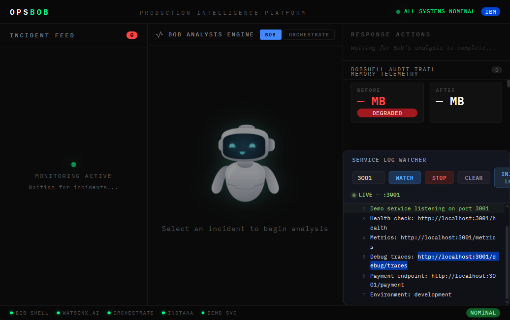

 

### From production signal to verified remediation — one governed, observable loop.

OpsBob detects incidents, gathers live context, asks IBM Bob to diagnose and propose a minimal fix, validates the change with Granite-powered specialist agents, and streams every decision to an IBM Carbon command center.

[Explore the architecture](#architecture) · [Run it locally](#quickstart) · [Trigger a demo](#run-the-demo) · [View the API](#api-surface)

Built by Team Dragorithm for the IBM Bob Hackathon 2026

---

## See it in action

  

<table>
  <tr>
    <td width="33%" align="center"><strong>01 · Observe</strong> Instana or a demo service raises an incident with metrics, traces, and service context.</td>
    <td width="33%" align="center"><strong>02 · Reason</strong> IBM Bob moves through ask → plan → code while Granite scores risk and confidence.</td>
    <td width="33%" align="center"><strong>03 · Remediate</strong> Specialist agents verify the patch before BobShell applies, tests, audits, and deploys it.</td>
  </tr>
</table>

> [!IMPORTANT]
> OpsBob is a hackathon reference implementation. Its deployment path is intentionally guarded by analysis, tests, an approval decision, and an audit stream. Review the generated patch and configure your own production controls before connecting real infrastructure.

## Why OpsBob

Traditional incident response scatters context across alerts, dashboards, terminals, source repositories, and ticket queues. OpsBob turns those disconnected steps into one traceable system:

| Challenge | OpsBob response |
|---|---|
| Alert fatigue with thin context | Enriches incidents with metrics, stack traces, source, and similar historical incidents |
| Slow root-cause analysis | Uses IBM Bob's three-phase reasoning against the live codebase |
| Risky AI-generated fixes | Runs static analysis, tests, risk scoring, and an explicit approval route |
| Opaque automation | Streams diagnosis, agent state, deployment output, and audit events over SSE |
| Repeated failures | Stores post-incident reports as searchable institutional memory |

## The autonomous loop

~~~mermaid
flowchart LR
    A["Incident Instana / Demo"] --> B["Enrich metrics + traces + source"]
    B --> C["IBM Bob ask → plan → code"]
    C --> D["Granite risk assessment"]
    D --> E["Specialist agents analyze + test + route"]
    E --> F{"Commander decision"}
    F -->|approve| G["BobShell apply + test + deploy"]
    F -->|escalate| H["Human review"]
    F -->|reject| I["Stop + audit"]
    G --> J["Incident memory postmortem + evidence"]
    J -. similar incident .-> B

    classDef signal fill:#2d0709,stroke:#fa4d56,color:#fff;
    classDef ai fill:#071a38,stroke:#4589ff,color:#fff;
    classDef guard fill:#1c0f2e,stroke:#a56eff,color:#fff;
    classDef action fill:#062b18,stroke:#42be65,color:#fff;
    class A signal;
    class B,C,D ai;
    class E,F,H,I guard;
    class G,J action;
~~~

## Architecture

~~~mermaid
flowchart TB
    subgraph Signals["Signals & observability"]
        INSTANA["IBM Instana"]
        DEMOS["Demo services :3002–:3005"]
        MCP["Instana MCP server"]
        INSTANA --> MCP
    end

    subgraph Core["OpsBob control plane · FastAPI :8001"]
        WEBHOOK["Incident intake"]
        MEMORY["Incident memory"]
        HEALTH["Health monitor"]
        SSE["Live SSE streams"]
        WEBHOOK <--> MEMORY
        WEBHOOK --> SSE
        HEALTH --> SSE
    end

    subgraph Intelligence["Reasoning & governance"]
        BOB["IBM Bob diagnose + generate"]
        WX["watsonx.ai / Granite risk + analysis"]
        ORCH["watsonx Orchestrate Commander"]
        AGENTS["Static analysis · Test runner Approval router · Post-incident"]
        BOB --> WX --> ORCH
        ORCH <--> AGENTS
    end

    subgraph Delivery["Delivery & experience"]
        SHELL["BobShell patch + test + deploy"]
        UI["React + IBM Carbon Command Center :3000"]
        GIT["Git repository"]
        SHELL --> GIT
    end

    DEMOS --> WEBHOOK
    MCP --> WEBHOOK
    WEBHOOK --> BOB
    ORCH -->|approved| SHELL
    SSE --> UI
    DEMOS -->|live logs| UI
~~~

### Decision path

| Stage | Engine | Output |
|---|---|---|
| Detect | Instana webhook or demo trigger | Normalized incident payload |
| Enrich | MCP + source reader + incident memory | Metrics, traces, code, and similar cases |
| Diagnose | IBM Bob | Root cause, minimal patch, and regression test |
| Assess | watsonx.ai / Granite | Confidence, blast radius, and recommended action |
| Verify | Four specialist agents | Static-analysis verdict, test results, and routing evidence |
| Decide | watsonx Orchestrate Commander | <code>approve</code>, <code>escalate</code>, or <code>reject</code> |
| Deliver | BobShell | Applied patch, git evidence, tests, restart/deploy, and audit events |
| Learn | Granite post-incident agent | Durable incident history for future similarity matching |

## Capability map

<table>
  <tr>
    <td width="50%" valign="top">
      <h3>🧠 Context-aware diagnosis</h3>
      
Combines observability evidence, relevant source files, and past incidents before reasoning about a fix.

    </td>
    <td width="50%" valign="top">
      <h3>🛡️ Governed remediation</h3>
      
Separates generation from approval with risk scoring, static review, regression tests, and a Commander decision.

    </td>
  </tr>
  <tr>
    <td width="50%" valign="top">
      <h3>⚡ Real-time operations UI</h3>
      
Streams analysis and deployment events into a dark IBM Carbon dashboard with incident, health, and audit views.

    </td>
    <td width="50%" valign="top">
      <h3>🗂️ Institutional memory</h3>
      
Records outcomes and matches new incidents against previous failures so the response loop improves over time.

    </td>
  </tr>
</table>

## IBM technology

| Product | Role in OpsBob |
|---|---|
| **IBM Bob** | Reads the affected code and performs the <code>ask → plan → code</code> diagnosis workflow |
| **IBM watsonx.ai + Granite** | Produces structured risk, static-analysis, commit, and post-incident intelligence |
| **IBM watsonx Orchestrate** | Coordinates the specialist-agent pipeline and issues the final decision |
| **IBM Instana** | Supplies incidents and observability context through an MCP adapter |
| **IBM Carbon Design System** | Powers the responsive command-center interface and operations visual language |
| **IBM Cloud IAM** | Exchanges the API key for short-lived service tokens |

## Quickstart

### Prerequisites

- Python 3.10+
- Node.js 18+ and npm
- IBM Bob CLI
- IBM Cloud credentials for watsonx.ai; Orchestrate and Instana are optional for the local fallback path

### 1. Clone and configure

~~~bash
git clone https://github.com/Senaaravichandran/OpsBob.git
cd OpsBob
cp .env.example .env
~~~

Set at least <code>WATSONX_API_KEY</code>, <code>WATSONX_PROJECT_ID</code>, <code>WATSONX_URL</code>, and <code>SOURCE_FILES_PATH</code> in <code>.env</code>. Never commit the populated file.

### 2. Install dependencies

~~~bash
# Backend
python -m venv .venv
source .venv/bin/activate          # Windows: .venv\Scripts\activate
pip install -r backend/requirements.txt

# Frontend
cd frontend && npm install && cd ..

# Instana MCP adapter
cd mcp-server && npm install && npm run build && cd ..

# Demo services
for service in demo-service1 demo-service2 demo-service3 demo-service4; do
  (cd "$service" && npm install)
done
~~~

### 3. Start the stack

Open separate terminals from the repository root:

~~~bash
# Terminal 1 · API
python -m uvicorn backend.main:app --host 0.0.0.0 --port 8001 --reload

# Terminal 2 · Dashboard
cd frontend && npm run dev

# Terminal 3 · Demo services
python start_demo_services.py
~~~

Open **http://localhost:3000**. Confirm the backend at **http://localhost:8001/health**.

> [!TIP]
> On macOS/Linux, <code>./startup.sh</code> validates the configured IBM dependencies and starts the MCP server plus backend. The explicit commands above are easier for a first local demo and work across platforms.

## Run the demo

The repository includes deliberately faulty services plus a clean baseline:

| Service | Port | Scenario |
|---|---:|---|
| <code>demo-service1</code> | 3002 | Unbounded session cache / memory leak |
| <code>demo-service2</code> | 3003 | Blocking synchronous work / CPU spike |
| <code>demo-service3</code> | 3004 | Connection-pressure scenario |
| <code>demo-service4</code> | 3005 | Clean bounded-cache baseline |

Trigger each incident-producing service once:

~~~bash
python inject_incidents.py --once
~~~

Or run a controlled burst:

~~~bash
python inject_incidents.py --count 10 --burst 2 --min 5 --max 15 --verbose
~~~

Then follow the incident in the dashboard:

~~~text
Incident Feed
   └─ Bob Analysis Engine
       └─ Granite Risk Assessment
           └─ Specialist Agent Pipeline
               └─ Commander Decision
                   └─ BobShell Audit Trail
~~~

## Configuration

<strong>Core environment variables</strong>

| Variable | Required | Purpose |
|---|:---:|---|
| <code>WATSONX_API_KEY</code> | Yes | IBM Cloud API key used for watsonx.ai access |
| <code>WATSONX_PROJECT_ID</code> | Yes | watsonx.ai project identifier |
| <code>WATSONX_URL</code> | Yes | Regional watsonx.ai endpoint |
| <code>SOURCE_FILES_PATH</code> | Yes | Repository-relative service source directory |
| <code>BOB_API_KEY</code> | For remote Bob | IBM Bob API credential |
| <code>ORCHESTRATE_HOST</code> | For Orchestrate | Orchestrate service host |
| <code>ORCHESTRATE_INSTANCE_ID</code> | For Orchestrate | Orchestrate instance identifier |
| <code>ORCHESTRATE_AGENT_ID</code> | For Orchestrate | Commander agent identifier |
| <code>INSTANA_BASE_URL</code> | Optional | Instana tenant URL |
| <code>INSTANA_API_TOKEN</code> | Optional | Instana API token |
| <code>BACKEND_PORT</code> | No | API port; defaults to <code>8001</code> |
| <code>DEMO_SERVICE_URL</code> | No | Primary local demo-service URL |

See [<code>.env.example</code>](.env.example) for the complete template.

<strong>Local ports</strong>

| Port | Process |
|---:|---|
| 3000 | Vite / React dashboard |
| 3001 | Primary legacy demo service |
| 3002–3004 | Incident-producing demo services |
| 3005 | Clean comparison service |
| 8001 | FastAPI control plane |

## API surface

Interactive OpenAPI docs are available at **http://localhost:8001/docs** while the backend is running.

| Method | Endpoint | Purpose |
|---|---|---|
| <code>POST</code> | <code>/webhook</code> | Ingest and normalize an incident |
| <code>GET</code> | <code>/stream/{incidentId}</code> | Stream Bob diagnosis and risk events |
| <code>POST</code> | <code>/orchestrate/prepare/{incidentId}</code> | Prepare an incident for the agent pipeline |
| <code>GET</code> | <code>/orchestrate/stream/{incidentId}</code> | Stream agent and Commander events |
| <code>POST</code> | <code>/approve/{incidentId}</code> | Record an approval action |
| <code>GET</code> | <code>/deploy-stream/{incidentId}</code> | Stream BobShell deployment events |
| <code>GET</code> | <code>/incidents</code> | List active incidents |
| <code>GET</code> | <code>/audit/{incidentId}</code> | Retrieve incident audit evidence |
| <code>GET</code> | <code>/system-health</code> | Aggregate component health |
| <code>GET</code> | <code>/memory-stats</code> | Inspect institutional-memory statistics |
| <code>GET</code> | <code>/health</code> | Lightweight API health check |

Full schemas are committed in [<code>openapi.json</code>](openapi.json) and [<code>openapi-orchestrate.json</code>](openapi-orchestrate.json).

## Repository map

~~~text
OpsBob/
├── backend/                  # FastAPI control plane, Bob client, agents, deployment
├── frontend/                 # React + Vite + IBM Carbon command center
├── mcp-server/               # TypeScript Instana MCP adapter
├── orchestrate/              # Specialist-agent definitions
├── demo-service/             # Primary payment demo + regression tests
├── demo-service1..4/         # Multi-scenario incident lab
├── landing/                  # Standalone product landing page
├── docs/assets/              # README and documentation visuals
├── inject_incidents.py       # Repeatable incident/load injector
├── start_demo_services.py    # Multi-service launcher
├── startup.sh                # Validated backend/MCP startup
└── openapi*.json             # API contracts
~~~

## Safety model

OpsBob's automation is designed around evidence and explicit gates:

1. **Minimal scope** — Bob is prompted to change only the affected file and create a regression test.
2. **Static review** — Granite checks the proposed diff for correctness and security concerns.
3. **Executable proof** — the test runner records pass/fail output before routing.
4. **Risk-aware decision** — confidence and blast radius feed the Commander decision.
5. **Approval boundary** — only approved incidents enter the deployment stream.
6. **Auditability** — each action is emitted to the UI and retained with incident history.
7. **Rollback readiness** — deployment evidence keeps the previous state visible for recovery.

## Verification

~~~bash
# Frontend production build
cd frontend && npm run build

# MCP TypeScript build
cd mcp-server && npm run build

# Primary demo-service regression suite
cd demo-service && npm install && npm test

# Python syntax check
python -m compileall backend inject_incidents.py start_demo_services.py
~~~

## Contributing

Issues and focused pull requests are welcome. Keep generated fixes small, include a regression test for behavior changes, never commit credentials or incident data, and describe the evidence behind operational decisions.

---

**OpsBob** · Autonomous production intelligence, built with IBM.

[Back to top](#)

