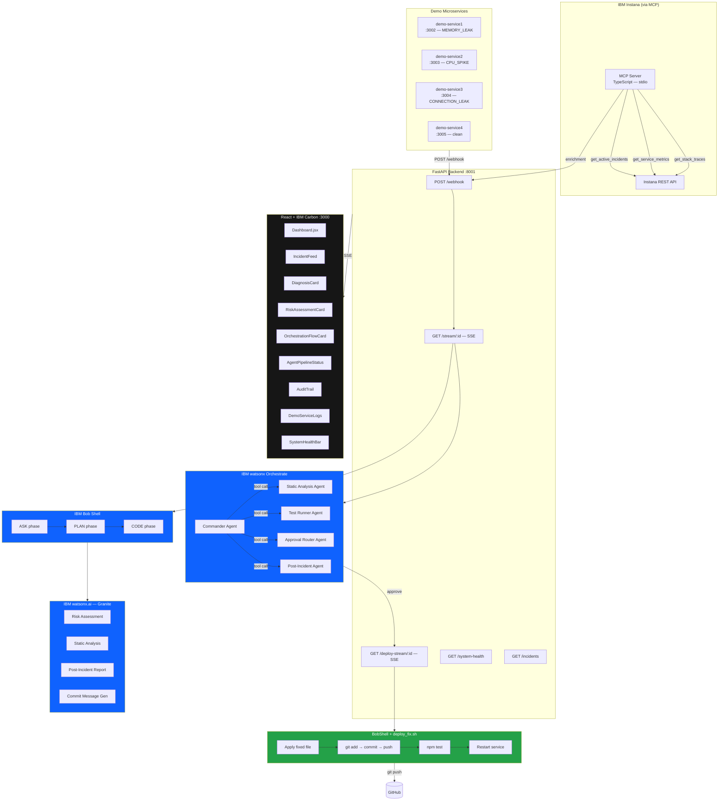

<div align="center">

# ⚡ OpsBob
### Autonomous Production Intelligence Platform
#### Built on IBM Bob · IBM watsonx.ai · IBM watsonx Orchestrate · IBM Instana · IBM Carbon

---

> **OpsBob** is a fully autonomous SRE (Site Reliability Engineering) platform that detects production incidents, diagnoses root causes using IBM Bob's AI reasoning, verifies fixes through a four-agent pipeline powered by IBM watsonx Orchestrate and IBM Granite, and deploys approved changes — all without human intervention.
>
> Built for the **IBM Bob Hackathon 2026**.

</div>

---

## Table of Contents

- [IBM Technology Stack](#ibm-technology-stack)
- [What OpsBob Does](#what-opsbob-does)
- [End-to-End Pipeline](#end-to-end-pipeline)
- [Architecture](#architecture)
- [IBM Bob — AI Orchestrator](#ibm-bob--ai-orchestrator)
- [IBM watsonx.ai — Granite Models](#ibm-watsonxai--granite-models)
- [IBM watsonx Orchestrate — Commander \& Agent Pipeline](#ibm-watsonx-orchestrate--commander--agent-pipeline)
- [IBM Instana — Observability via MCP](#ibm-instana--observability-via-mcp)
- [IBM Carbon Design System — Dashboard](#ibm-carbon-design-system--dashboard)
- [IBM Cloud IAM — Token Exchange](#ibm-cloud-iam--token-exchange)
- [Demo Services — Live Buggy Microservices](#demo-services--live-buggy-microservices)
- [BobShell — Deployment Orchestrator](#bobshell--deployment-orchestrator)
- [Incident Intelligence — Institutional Memory](#incident-intelligence--institutional-memory)
- [Inject Incidents — Load Simulator](#inject-incidents--load-simulator)
- [Project Structure](#project-structure)
- [Quickstart](#quickstart)
- [Environment Variables](#environment-variables)
- [API Reference](#api-reference)

---

## IBM Technology Stack

| IBM Product | Version / Model | Role in OpsBob |
|---|---|---|
| **IBM Bob Shell** | Latest CLI / vendored `bob.js` | Three-phase AI reasoning engine: `ask` → `plan` → `code`. Reads live source code, identifies root cause, generates minimal fix + regression test. |
| **IBM watsonx.ai** | `us-south.ml.cloud.ibm.com` | Hosts Granite models for risk assessment, static code analysis, commit message generation, and post-incident reporting. |
| **IBM Granite** | `ibm/granite-4-h-small` (configurable) | LLM powering all AI inference — risk scoring, security verdicts, incident summaries. Zero external LLM dependency. |
| **IBM watsonx Orchestrate** | REST API v1 (Runs API) | Commander agent orchestrates four specialist sub-agents via tool calls. Makes the final approve / escalate / reject decision before deployment. |
| **IBM Instana** | REST API + MCP Server | Application performance monitoring. Provides active incidents, service metrics, and stack traces via the Model Context Protocol. Falls back to live demo-service data. |
| **IBM Carbon Design System** | `@carbon/react ^1.45.0` | Entire frontend — components, icons (`@carbon/icons-react`), color tokens, IBM Plex typography, and dark operations theme. |
| **IBM Cloud IAM** | `iam.cloud.ibm.com/identity/token` | Exchanges the IBM Cloud API key for short-lived Bearer tokens used by watsonx.ai and watsonx Orchestrate. Cached 55 min with automatic refresh. |
| **IBM Cloud Code Engine** | Container deployment target | Target runtime for automated `gcloud` / Code Engine deploys triggered by BobShell after fix approval. |

---

## What OpsBob Does

OpsBob runs a **fully autonomous incident response loop**:

1. **Detect** — A webhook fires from IBM Instana (or a demo service) when a service anomaly is detected (memory leak, CPU spike, connection leak).
2. **Enrich** — The backend pulls stack traces, service metrics, and source code to assemble a rich prompt context.
3. **Diagnose** — IBM Bob's `ask → plan → code` pipeline identifies the root cause and generates a corrected source file plus a regression test.
4. **Assess** — IBM watsonx.ai Granite scores the fix for confidence and blast radius. A structured risk assessment is streamed to the dashboard in real time.
5. **Verify** — A four-agent pipeline (static analysis, test runner, approval router — all powered by Granite) validates correctness and security before any deployment.
6. **Decide** — IBM watsonx Orchestrate's Commander agent reviews all signals and issues a final `approve`, `escalate`, or `reject` decision.
7. **Deploy** — BobShell applies the fix, commits to git, pushes to the remote branch, runs tests, and restarts the service. Every step is streamed to the dashboard.
8. **Report** — A post-incident report is generated by Granite and appended to `incident-history.json` as institutional memory for future incidents.

---

## End-to-End Pipeline

```
 Instana Webhook  ─────────────────────────────────────────────────────────────────────┐
 (or demo trigger)                                                                      │
                                                                                        ▼
                                                                         ┌──────────────────────────┐
                                                                         │   FastAPI Backend         │
                                                                         │   POST /webhook           │
                                                                         │                          │
                                                                         │  ① MCP enrichment        │
                                                                         │    (Instana → metrics,   │
                                                                         │     stack traces)        │
                                                                         │                          │
                                                                         │  ② Source code read      │
                                                                         │    (server.js, routes,   │
                                                                         │     store, middleware)   │
                                                                         │                          │
                                                                         │  ③ Institutional memory  │
                                                                         │    (incident-history.json│
                                                                         │     similarity match)    │
                                                                         └────────────┬─────────────┘
                                                                                      │
                                                                                      ▼
                                                                         ┌──────────────────────────┐
                                                                         │     IBM Bob Shell         │
                                                                         │                          │
                                                                         │  ASK  → reads codebase   │
                                                                         │  PLAN → root cause +     │
                                                                         │         fix proposal     │
                                                                         │  CODE → corrected file   │
                                                                         │         + regression test│
                                                                         └────────────┬─────────────┘
                                                                                      │  SSE stream
                                                                                      ▼
                                                                         ┌──────────────────────────┐
                                                                         │  IBM watsonx.ai (Granite) │
                                                                         │                          │
                                                                         │  Risk assessment:        │
                                                                         │  • confidence level      │
                                                                         │  • blast radius          │
                                                                         │  • recommended action    │
                                                                         └────────────┬─────────────┘
                                                                                      │
                                                                                      ▼
                                                                    ┌─────────────────────────────────┐
                                                                    │  Four-Agent Verification Pipeline│
                                                                    │  (Granite-powered)              │
                                                                    │                                 │
                                                                    │  Agent 1: Static Analysis       │
                                                                    │    → security review, PASS/WARN/│
                                                                    │      FAIL verdict on code diff  │
                                                                    │                                 │
                                                                    │  Agent 2: Test Runner           │
                                                                    │    → npm test, pass/fail counts │
                                                                    │                                 │
                                                                    │  Agent 3: Approval Router       │
                                                                    │    → signal aggregation →       │
                                                                    │      approve / review / escalate│
                                                                    │                                 │
                                                                    │  Agent 4: Post-Incident Report  │
                                                                    │    → Granite summary →          │
                                                                    │      incident-history.json      │
                                                                    └────────────┬────────────────────┘
                                                                                 │
                                                                                 ▼
                                                                    ┌────────────────────────────────┐
                                                                    │  IBM watsonx Orchestrate        │
                                                                    │  Commander Agent               │
                                                                    │                                │
                                                                    │  Reviews all agent outputs →   │
                                                                    │  APPROVE / ESCALATE / REJECT   │
                                                                    └────────────┬───────────────────┘
                                                                                 │ approve
                                                                                 ▼
                                                                    ┌────────────────────────────────┐
                                                                    │  BobShell Deployment           │
                                                                    │                                │
                                                                    │  1. Apply fixed file to repo   │
                                                                    │  2. git diff → commit → push   │
                                                                    │  3. Run regression test suite  │
                                                                    │  4. Restart service            │
                                                                    │  5. Stream audit log to UI     │
                                                                    └────────────┬───────────────────┘
                                                                                 │
                                                                                 ▼
                                                                    ┌────────────────────────────────┐
                                                                    │  IBM Carbon Dashboard          │
                                                                    │                                │
                                                                    │  • Incident Feed               │
                                                                    │  • Bob Diagnosis Panel         │
                                                                    │  • Risk Assessment Card        │
                                                                    │  • Orchestration Flow Card     │
                                                                    │  • Agent Pipeline Status       │
                                                                    │  • BobShell Audit Trail        │
                                                                    │  • Memory Telemetry            │
                                                                    │  • System Health Bar           │
                                                                    │  • Service Log Watcher         │
                                                                    └────────────────────────────────┘
```

---

## Architecture



---

## IBM Bob — AI Orchestrator

**File:** `backend/bob_client.py`

IBM Bob is the core AI reasoning engine. OpsBob invokes it non-interactively via subprocess (CLI or vendored `vendor/bob.js` Node.js bundle), streaming its output as Server-Sent Events to the dashboard in real time.

### Three-Phase Reasoning

| Phase | What Bob Does | Output |
|---|---|---|
| **ASK** | Reads all source files — `server.js`, `routes/payments.js`, `middleware/session.js`, `store/sessionStore.js`. Understands the full runtime context, stack traces, and memory growth metrics. | Streaming text to diagnosis panel |
| **PLAN** | Identifies the exact root cause (e.g., unbounded `sessionCache` Map with no TTL or eviction). Proposes a minimal, safe fix strategy. | Structured plan text → fed to Granite for risk scoring |
| **CODE** | Generates a complete, drop-in replacement source file with the fix applied. Also generates an optional regression test that would have caught the bug. | `fixed_code`, `target_file`, `regression_test_content`, `regression_test_file` |

### Bob Command Resolution

OpsBob resolves the Bob binary with full platform awareness:
- **Linux/macOS**: Uses the `bob` binary from `PATH` directly
- **Windows**: Detects `.cmd`/`.bat` scripts and falls back to the vendored `vendor/bob.js` + `node` for reliable piped subprocess execution
- **CI/Cloud Run**: Injects `BOB_FORCE_API_AUTH=true` to use API key auth instead of stored credentials

### Key Settings

| Env Var | Default | Purpose |
|---|---|---|
| `BOB_SHELL_COMMAND` | `bob` | Path or command name for Bob binary |
| `BOB_SHELL_MODEL` | (Bob default) | Override model used by Bob |
| `BOB_SHELL_APPROVAL_MODE` | `yolo` | Bob approval mode (`yolo` = non-interactive) |
| `BOB_SHELL_TIMEOUT_SECONDS` | `300` | Max seconds before Bob subprocess is killed |
| `BOB_API_KEY` | — | IBM Bob API key (required for Cloud Run) |

---

## IBM watsonx.ai — Granite Models

**File:** `backend/watsonx_client.py`  
**Model:** `ibm/granite-4-h-small` (configurable via `WATSONX_MODEL_ID`)  
**Endpoint:** `https://us-south.ml.cloud.ibm.com/ml/v1/text/generation`

Every AI inference call in OpsBob — outside of Bob itself — runs through IBM Granite. There are no OpenAI or Anthropic dependencies.

### Granite-Powered Capabilities

| Capability | Prompt Strategy | Output Schema |
|---|---|---|
| **Risk Assessment** | System prompt: production risk assessor. Input: Bob's plan text. | `{ confidence, risk_level, estimated_blast_radius, recommended_action, reasoning }` |
| **Static Analysis** | System prompt: senior security engineer. Input: code diff + root cause. | `{ verdict: PASS/WARN/FAIL, findings: string[] }` |
| **Post-Incident Report** | System prompt: SRE writer. Input: timeline + resolution. | `{ timeline, root_cause, fix_summary, prevention, runbook_entry }` |
| **Commit Message** | Concise conventional-commit format. Input: incident ID + code summary. | `fix(INC-xxx): description — ISO timestamp` |

### Auth Flow

```
WATSONX_API_KEY
      │
      ▼
IBM Cloud IAM  (iam.cloud.ibm.com/identity/token)
      │
      ▼
Bearer token (55-min TTL, auto-refreshed in-memory cache)
      │
      ▼
watsonx.ai REST API  →  Granite inference
```

---

## IBM watsonx Orchestrate — Commander & Agent Pipeline

**Files:** `backend/orchestrate_client.py`, `backend/orchestrate_agents.py`, `orchestrate/*.yaml`

IBM watsonx Orchestrate is the decision authority in OpsBob. A Commander agent receives the full incident context and verification data, then coordinates four specialist sub-agents via tool calls to reach a final approve / escalate / reject decision.

### Commander Agent Flow

```
POST /v1/orchestrate/runs  (async, polled)
      │
      ├─ tool: review_code_fix       → Static Analysis Agent  → Granite
      ├─ tool: run_regression_tests  → Test Runner Agent       → local npm test
      ├─ tool: route_fix_approval    → Approval Router Agent   → pure logic
      └─ tool: generate_incident_report → Post-Incident Agent  → Granite
            │
            ▼
      Commander decision: approve | escalate | reject
```

### The Four Specialist Agents

#### 1. Static Analysis Agent (`orchestrate/static_analysis_agent.yaml`)
- **Model:** `ibm/granite-4-h-small`
- **Role:** Senior security engineer — reviews Bob's code diff for null pointer risks, injection vulnerabilities, logic errors, and whether the fix addresses the stated root cause
- **Tool endpoint:** `POST /orchestrate/static-analysis`
- **Output:** `{ verdict: PASS|WARN|FAIL, findings: string[] }`

#### 2. Test Runner Agent (`orchestrate/test_runner_agent.yaml`)
- **Model:** `ibm/granite-4-h-small`
- **Role:** Executes `npm test` on the affected service. Blocks deployment if any test fails
- **Tool endpoint:** `POST /orchestrate/run-tests`
- **Output:** `{ passed, failed, verdict: PASS|WARN|FAIL, output }`

#### 3. Approval Router Agent (`orchestrate/approval_router_agent.yaml`)
- **Model:** `ibm/granite-4-h-small`
- **Role:** Aggregates risk score, static verdict, and test results into a routing decision
- **Tool endpoint:** `POST /orchestrate/route-approval`
- **Output:** `{ recommendation: approve|review|escalate, routing_reason, route_to, urgency }`

#### 4. Post-Incident Report Agent (`orchestrate/post_incident_agent.yaml`)
- **Model:** `ibm/granite-4-h-small`
- **Role:** After resolution, generates a structured incident report and appends it to `incident-history.json` as institutional memory
- **Tool endpoint:** `POST /orchestrate/post-incident`
- **Output:** `{ report: { timeline, root_cause, fix_summary, prevention }, runbook_entry }`

### Orchestrate Skill Definition

`orchestrate_skill.json` defines the `review_bob_fix` skill — a reusable watsonx Orchestrate skill that routes Bob's fix proposals to on-call engineers, with automatic escalation to senior engineers when confidence is low.

### Auto-Deploy on Approval

When the Commander returns `decision: approve`, OpsBob automatically transitions to the deployment phase — no human button click required. The full pipeline is zero-touch when confidence and verification signals are all green.

---

## IBM Instana — Observability via MCP

**File:** `mcp-server/src/index.ts`  
**Protocol:** Model Context Protocol (MCP) over stdio  
**Transport:** JSON-RPC 2.0

The MCP server bridges IBM Instana's REST API to OpsBob's Python backend. When Instana credentials are configured, it makes live API calls. Without them, it serves realistic demo data from the live demo-service processes.

### MCP Tools Exposed

| Tool | Instana API | Fallback |
|---|---|---|
| `get_active_incidents` | `GET /api/events` | Static realistic incident data |
| `get_service_metrics` | `GET /api/metrics` | Live `demo-service/metrics` endpoint |
| `get_stack_traces` | `GET /api/traces` | Live `demo-service/debug/traces` endpoint |

### How the Backend Calls MCP

`backend/mcp_client.py` spawns the compiled MCP server (`mcp-server/dist/index.js`) as a subprocess, communicates via stdin/stdout using JSON-RPC 2.0, and parses the tool results for prompt enrichment. If MCP fails for any reason, the backend falls back to direct HTTP calls to the demo service.

### Instana Configuration

```env
INSTANA_BASE_URL=https://your-tenant.instana.io
INSTANA_API_TOKEN=your_instana_api_token
```

Without these, all three MCP tools return live data from `demo-service/` — the demo runs fully self-contained with no external observability dependency.

---

## IBM Carbon Design System — Dashboard

**Frontend:** `frontend/src/` — React 18 + Vite 5  
**Packages:** `@carbon/react ^1.45.0`, `@carbon/icons-react ^11.35.0`, `@carbon/colors ^11.20.0`

The entire OpsBob dashboard is built with the IBM Carbon Design System. Every interactive element — buttons, tags, panels, and status indicators — uses Carbon components and Carbon-compatible CSS custom properties.

### Dashboard Components

| Component | Purpose |
|---|---|
| `IncidentFeed` | Live polling (`/incidents` every 5s) — shows all active incidents with severity tags and status |
| `DiagnosisCard` | Streams Bob's ask/plan/code output phases with typewriter SSE rendering |
| `RiskAssessmentCard` | Displays Granite's risk score, blast radius, and recommended action |
| `OrchestrationFlowCard` | Visual flowchart of the watsonx Orchestrate pipeline execution |
| `AgentPipelineStatus` | Real-time status of all four Orchestrate specialist agents with verdicts |
| `OrchestratePanel` | Manual Orchestrate trigger and commander output viewer |
| `FixActions` | Approve / Reject buttons for human-in-the-loop override |
| `AuditTrail` | BobShell deployment log with color-coded event types (log / git_push / error / agent) |
| `MemoryTelemetry` | Before/after memory comparison + MTTR display |
| `SystemHealthBar` | Live health dots for BOB SHELL, WATSONX.AI, ORCHESTRATE, INSTANA, DEMO SVC |
| `DemoServiceLogs` | Real-time SSE log watcher for any demo service — port-selectable, with Inject Load |

### Carbon Tokens Used

```css
--ob-bg              /* Carbon Gray 100 */
--ob-border          /* Carbon Gray 80  */
--ob-text-primary    /* Carbon Gray 10  */
--ob-text-secondary  /* Carbon Gray 30  */
--ob-text-muted      /* Carbon Gray 50  */
--ob-accent-green    /* Carbon Green 40 */
--ob-accent-red      /* Carbon Red 40   */
--ob-accent-blue     /* Carbon Blue 40  */
--ob-accent-purple   /* Carbon Purple 40*/
```

**Typography:** IBM Plex Mono used throughout all log panels, audit trails, and code display areas.

### Vite Proxy

All `/api` traffic is proxied to the FastAPI backend — no CORS headers needed in development:

```
/webhook, /stream, /deploy-stream, /approve, /incidents,
/health, /audit, /runbook, /system-health, /memory-stats,
/incident-queue, /orchestrate, /demo-services
→ http://localhost:8001
```

---

## IBM Cloud IAM — Token Exchange

**File:** `backend/iam_auth.py`  
**Endpoint:** `https://iam.cloud.ibm.com/identity/token`

All IBM Cloud service calls — watsonx.ai and watsonx Orchestrate — require a short-lived IAM Bearer token, not the raw API key. `iam_auth.py` handles this transparently:

- Exchanges `WATSONX_API_KEY` for an access token with a 60-minute TTL
- Caches the token in memory per API key with a 55-minute window (5-minute buffer before expiry)
- Uses `asyncio.Lock` to prevent concurrent exchange requests for the same key
- Auto-refreshes on the next request when the cached token is near expiry

---

## Demo Services — Live Buggy Microservices

Four Express.js microservices simulate real production bugs. Each fires a webhook to the OpsBob backend when anomaly thresholds are crossed, enabling realistic end-to-end incident demonstrations.

| Service | Port | Bug Type | Auto-fire Threshold | Severity |
|---|---|---|---|---|
| `demo-service1` | 3002 | `MEMORY_LEAK` | `sessionCache.size >= 200` | HIGH |
| `demo-service2` | 3003 | `CPU_SPIKE` | `requestCount >= 20` | CRITICAL |
| `demo-service3` | 3004 | `CONNECTION_LEAK` | `pendingRequests.length >= 10` | HIGH |
| `demo-service4` | 3005 | Clean service | Never fires | — |

### Features on Every Service

- **Log ring-buffer** — Last 500 log lines retained; `console.log/warn/error` all captured
- **`GET /logs/stream`** — SSE endpoint that replays the buffer then streams live; consumed by the Service Log Watcher panel
- **`POST /trigger-incident`** — Immediately fires a webhook to the backend (bypasses debounce)
- **`fireWebhook(payload)`** — 10-second debounced HTTP POST to `http://localhost:8001/webhook`
- **`GET /health`**, **`GET /metrics`** — Real process memory and uptime data

### Primary Demo Service (`demo-service/`)

The original Payments API with the canonical memory leak bug:
- Prometheus-compatible `/metrics` endpoint
- Mocha test suite (`test/`)
- Stack trace capture (`debug/traces.js`)
- Secondary session store leak (`store/sessionStore.js`)
- Memory threshold monitor with `setInterval` alerting

---

## BobShell — Deployment Orchestrator

**Files:** `backend/bobshell.py`, `backend/deploy_fix.sh`

BobShell executes after Commander approval. It applies Bob's fix to the live repository and streams every step as an SSE audit log to the dashboard.

### Deployment Steps

```
deploy_fix.sh
  [1/3] Copy fixed source file → repo path
  [2/3] git diff → git add → git commit → git push origin <branch>
  [3/3] npm test (regression suite)
  [4/4] Restart demo service (SIGHUP if running)
  → RESOLVED:<incidentId>
```

### Git Auto-Push Logic

- Checks `git diff` first — warns if no change detected (idempotent)
- Commits with conventional format: `fix(INC-xxx): auto-deploy agent fix — <ISO timestamp>`
- Detects current branch automatically (`git rev-parse --abbrev-ref HEAD`)
- Pushes to `origin/<branch>` — skips gracefully if no remote configured
- Regression test file is also staged and committed if present

### Audit Event Types

| SSE `type` | Dashboard Rendering |
|---|---|
| `log` | Standard mono text |
| `git_push` | Gold/yellow highlight with `⬆` prefix |
| `error` | Red text |
| `agent` | Purple text |
| `completion` | Triggers MTTR display + memory after metric |

### Rollback

`bobshell.py` includes an automatic rollback function that fires if post-deployment health checks detect issues. It issues a `gcloud` / Code Engine rollback to the previous container revision.

---

## Incident Intelligence — Institutional Memory

**File:** `backend/incident_intelligence.py`  
**Data:** `incident-history.json`

Every resolved incident is appended to `incident-history.json` by the Post-Incident Report Agent. On the next incident, OpsBob searches this history to find similar past events and enriches Bob's prompt with proven fix strategies.

### Similarity Scoring

```python
score += 5   # exact service name match
score += 2   # per keyword overlap between incident types
score += 3   # "memory" / "cache" / "leak" pattern match
```

The top 3 most relevant past incidents are injected into Bob's context, enabling Bob to learn from previous fixes rather than starting cold every time.

### Memory Stats Endpoint

`GET /memory-stats` returns the total count of resolved incidents, average MTTR, and a breakdown by incident type — displayed on the dashboard.

---

## Inject Incidents — Load Simulator

**File:** `inject_incidents.py`

A zero-dependency Python script that randomly triggers incidents across demo-services 1–3, simulating a realistic on-call environment for demos and development.

```bash
# Fire each service once — quick end-to-end test
python inject_incidents.py --once

# Continuous random injection (Ctrl+C to stop)
python inject_incidents.py

# Burst mode: 2 incidents every 5–15s, stop after 10 total
python inject_incidents.py --count 10 --burst 2 --min 5 --max 15

# Also spam /payment calls to hit auto-fire memory thresholds
python inject_incidents.py --payments 50

# Verbose — show full webhook response bodies
python inject_incidents.py --verbose --once
```

The script performs a pre-flight health check (`/health`) on each service port, displays live coloured output per fire, and provides a summary count on exit.

---

## Project Structure

```
OpsBob/
│
├── backend/                        FastAPI orchestration layer (Python 3.12)
│   ├── main.py                     All endpoints: webhook, SSE stream, approve, deploy, Orchestrate tools
│   ├── bob_client.py               IBM Bob subprocess integration, structured fix extraction
│   ├── watsonx_client.py           IBM watsonx.ai / Granite client, risk assessment
│   ├── iam_auth.py                 IBM Cloud IAM token exchange with in-memory caching
│   ├── orchestrate_client.py       IBM watsonx Orchestrate Runs API client + polling
│   ├── orchestrate_agents.py       Four-agent pipeline: static analysis, test runner, router, report
│   ├── mcp_client.py               MCP stdio client → Instana MCP server
│   ├── bobshell.py                 BobShell deployment orchestrator + SSE audit streaming
│   ├── deploy_fix.sh               Bash recipe: copy fix → git commit → push → test → restart
│   ├── health_monitor.py           System health checks for all IBM services (cached 30s)
│   ├── incident_intelligence.py    Institutional memory — similarity scoring, context enrichment
│   ├── Dockerfile                  Multi-stage: node-runtime + python:3.12-slim
│   ├── requirements.txt            fastapi, uvicorn, pydantic, aiohttp, python-dotenv
│   └── vendor/
│       └── bob.js                  Vendored Bob CLI bundle for Windows subprocess reliability
│
├── frontend/                       React 18 + Vite 5 + IBM Carbon
│   ├── src/
│   │   ├── Dashboard.jsx           Main layout: 3-column Carbon dashboard, all SSE wiring
│   │   └── components/
│   │       ├── IncidentFeed        Live incident list with Carbon Tags
│   │       ├── DiagnosisCard       Bob ask/plan/code streaming display
│   │       ├── RiskAssessmentCard  Granite risk scores with confidence meter
│   │       ├── OrchestrationFlowCard  Orchestrate pipeline visual flow
│   │       ├── AgentPipelineStatus Four-agent status with PASS/WARN/FAIL badges
│   │       ├── OrchestratePanel    Manual Orchestrate trigger + commander output
│   │       ├── FixActions          Approve / Reject buttons with Carbon Button
│   │       ├── AuditTrail          BobShell deployment log (colour-coded by event type)
│   │       ├── MemoryTelemetry     Before/after heap comparison + MTTR
│   │       ├── SystemHealthBar     Live health dots for all IBM services
│   │       └── DemoServiceLogs     Port-selectable SSE log watcher + Inject Load
│   ├── vite.config.js              All API paths proxied to FastAPI :8001
│   └── package.json                @carbon/react, @carbon/icons-react, @carbon/colors
│
├── mcp-server/                     TypeScript MCP server — IBM Instana integration
│   └── src/index.ts                get_active_incidents, get_service_metrics, get_stack_traces
│
├── orchestrate/                    IBM watsonx Orchestrate agent definitions (YAML)
│   ├── static_analysis_agent.yaml  Code security reviewer — Granite
│   ├── test_runner_agent.yaml      npm test executor
│   ├── approval_router_agent.yaml  Signal aggregator — Granite
│   └── post_incident_agent.yaml    Report generator — Granite
│
├── demo-service/                   Primary Payments API (memory leak demo)
│   ├── server.js                   Express app with unbounded sessionCache bug
│   ├── metrics.js                  Real Prometheus-compatible metrics
│   ├── debug/traces.js             Stack trace capture
│   ├── store/sessionStore.js       Secondary session store (also leaks)
│   └── test/                       Mocha regression tests
│
├── demo-service1/                  :3002 — MEMORY_LEAK (sessionCache)
├── demo-service2/                  :3003 — CPU_SPIKE (sync blocking compute)
├── demo-service3/                  :3004 — CONNECTION_LEAK (held-open requests)
├── demo-service4/                  :3005 — Clean service (nominal baseline)
│
├── orchestrate_skill.json          review_bob_fix watsonx Orchestrate skill definition
├── incident-history.json           Institutional memory — all resolved incidents
├── inject_incidents.py             Random incident load simulator (zero dependencies)
└── landing/                        Standalone IBM Carbon-themed landing page
```

---

## Quickstart

### Prerequisites

- **Python 3.12+**
- **Node.js 18+**
- **IBM Bob CLI** installed and authenticated (`bob auth`)

### 1. Clone & Configure

```bash
git clone https://github.com/Senaaravichandran/OpsBob.git
cd OpsBob
cp .env.example .env   # fill in your IBM credentials
```

### 2. Backend

```bash
cd backend
python -m venv ../.venv
..\.venv\Scripts\activate        # Windows
# source ../.venv/bin/activate   # macOS/Linux
pip install -r requirements.txt
uvicorn main:app --host 0.0.0.0 --port 8001 --reload
```

### 3. MCP Server (Instana)

```bash
cd mcp-server
npm install
npm run build
```
The MCP server is launched automatically as a subprocess by the backend when needed.

### 4. Frontend

```bash
cd frontend
npm install
npm run dev           # http://localhost:3000
```

### 5. Demo Services

```bash
cd demo-service1 ; npm start &   # :3002 — MEMORY_LEAK
cd demo-service2 ; npm start &   # :3003 — CPU_SPIKE
cd demo-service3 ; npm start &   # :3004 — CONNECTION_LEAK
cd demo-service4 ; npm start &   # :3005 — clean
```

### 6. Trigger an Incident

```bash
# Inject a random incident immediately
python inject_incidents.py --once

# Or run the continuous demo loop
python inject_incidents.py --min 10 --max 30
```

Open `http://localhost:3000` and watch OpsBob diagnose, verify, and resolve the incident autonomously.

---

## Environment Variables

```env
# ── IBM Bob Shell ─────────────────────────────────────────────
BOB_SHELL_COMMAND=bob               # Path or name of Bob CLI binary
BOB_SHELL_MODEL=                    # Override Bob's model (leave empty for default)
BOB_SHELL_APPROVAL_MODE=yolo        # Non-interactive mode
BOB_SHELL_TIMEOUT_SECONDS=300       # Subprocess timeout
BOB_API_KEY=                        # IBM Bob API key (required in Cloud Run / CI)
BOB_API_URL=                        # Custom Bob API URL (optional)
BOB_FORCE_API_AUTH=false            # Set true in CI to use API key auth
BOB_SHELL_ACCEPT_LICENSE=true       # Auto-accept Bob license
BOB_SHELL_TRUST=true                # Auto-trust Bob workspace

# ── IBM watsonx.ai ────────────────────────────────────────────
WATSONX_API_KEY=                    # IBM Cloud API key (also used for IAM + Orchestrate)
WATSONX_PROJECT_ID=                 # watsonx.ai project ID
WATSONX_SPACE_ID=                   # watsonx.ai deployment space ID (takes precedence)
WATSONX_URL=https://us-south.ml.cloud.ibm.com
WATSONX_MODEL_ID=ibm/granite-4-h-small

# ── IBM watsonx Orchestrate ───────────────────────────────────
ORCHESTRATE_HOST=https://api.us-south.watson-orchestrate.cloud.ibm.com
ORCHESTRATE_INSTANCE_ID=            # Your Orchestrate instance ID
ORCHESTRATE_AGENT_ID=               # Commander agent ID
ORCHESTRATE_ENV_ID=                 # Orchestrate environment ID

# ── IBM Instana ───────────────────────────────────────────────
INSTANA_BASE_URL=                   # https://your-tenant.instana.io
INSTANA_API_TOKEN=                  # Instana REST API token

# ── Backend ───────────────────────────────────────────────────
BACKEND_URL=http://localhost:8001
SOURCE_FILES_PATH=demo-service
DEMO_SERVICE_URL=http://localhost:3001

# ── IBM Cloud Code Engine (deployment target) ─────────────────
CODE_ENGINE_APP_NAME=payments-api
GCLOUD_PROJECT=                     # GCP project ID (optional)
GCLOUD_REGION=                      # GCP region (optional)
```

> All IBM credentials are optional for local development. OpsBob falls back gracefully at every integration point:
> - No Bob API key → uses stored `bob auth` credentials
> - No watsonx.ai credentials → uses local fallback risk scores
> - No Orchestrate credentials → uses local three-agent pipeline
> - No Instana credentials → uses live demo-service data

---

## API Reference

| Method | Endpoint | Description |
|---|---|---|
| `POST` | `/webhook` | Receive incident alert (from Instana or demo service) |
| `GET` | `/stream/{incidentId}` | SSE: Bob analysis → agent pipeline → Orchestrate decision |
| `POST` | `/approve/{incidentId}` | Manual approve/reject override |
| `GET` | `/deploy-stream/{incidentId}` | SSE: BobShell deployment audit log |
| `GET` | `/incidents` | All active incidents with full state |
| `GET` | `/incident-queue` | Queued incidents waiting for analysis slot |
| `GET` | `/audit/{incidentId}` | Full audit trail for an incident |
| `GET` | `/system-health` | Health of all IBM integrations (Bob, watsonx.ai, Orchestrate, Instana) |
| `GET` | `/memory-stats` | Institutional memory statistics |
| `GET` | `/runbook` | Current runbook recommendations |
| `POST` | `/orchestrate/decision` | Submit Commander approval decision |
| `GET` | `/orchestrate/stream/{incidentId}` | SSE: Direct Orchestrate commander execution stream |
| `POST` | `/orchestrate/static-analysis` | Agent tool: Granite static analysis |
| `POST` | `/orchestrate/run-tests` | Agent tool: npm test execution |
| `POST` | `/orchestrate/route-approval` | Agent tool: approval routing logic |
| `POST` | `/orchestrate/post-incident` | Agent tool: Granite post-incident report |
| `POST` | `/orchestrate/prepare/{incidentId}` | Prepare Orchestrate context for an incident |
| `GET` | `/demo-services/logs/{port}` | SSE: Live log stream from demo service on given port |
| `POST` | `/demo-services/{port}/payment` | Proxy: send a payment to demo service |
| `POST` | `/demo-services/{port}/trigger-incident` | Proxy: manually trigger incident webhook |
| `GET` | `/health` | Backend liveness check |

---

<div align="center">

**Built with ❤️ for the IBM Bob Hackathon 2026**

*IBM Bob · IBM watsonx.ai · IBM Granite · IBM watsonx Orchestrate · IBM Instana · IBM Carbon · IBM Cloud*

</div>
tasks/, docs/            Analysis notes, verification plans, and historical docs
```

Generated or runtime-heavy directories such as `node_modules`, `venv`, `.venv`, `__pycache__`, logs, and `demo-service1` through `demo-service4` are not part of the core source flow.

## Prerequisites

- Node.js 18+
- Python 3.9+; Python 3.12 is used by the backend Dockerfile
- npm
- Bash-compatible shell for `*.sh` scripts, such as Git Bash or WSL on Windows
- IBM Bob shell available as `bob`, or the vendored backend runtime at `backend/vendor/bob.js`
- IBM Cloud API key with watsonx.ai access
- Optional: IBM Instana tenant and API token
- Optional: watsonx Orchestrate instance, agent, and environment IDs

## Environment

Copy the template and fill the IBM values:

```bash
cp .env.example .env
```

Key variables:

```env
# IBM Bob
BOB_API_KEY=your_bob_api_key_here
BOB_API_URL=https://api.bob.ibm.com

# IBM watsonx.ai / Granite
WATSONX_API_KEY=your_watsonx_api_key_here
WATSONX_PROJECT_ID=your_project_id_here
WATSONX_SPACE_ID=
WATSONX_URL=https://us-south.ml.cloud.ibm.com
WATSONX_MODEL_ID=ibm/granite-4-h-small

# IBM watsonx Orchestrate
ORCHESTRATE_HOST=https://api.us-south.watson-orchestrate.cloud.ibm.com
ORCHESTRATE_INSTANCE_ID=your_instance_id
ORCHESTRATE_AGENT_ID=your_commander_agent_id
ORCHESTRATE_ENV_ID=your_environment_id
BACKEND_URL=http://localhost:8000

# IBM Instana, optional
INSTANA_BASE_URL=https://your-tenant.instana.io
INSTANA_API_TOKEN=your_instana_api_token_here

# Local demo
SOURCE_FILES_PATH=demo-service
DEMO_SERVICE_URL=http://localhost:3001
BACKEND_PORT=8000
DASHBOARD_URL=http://localhost:3000
```

The backend exchanges IBM Cloud API keys for IAM bearer tokens in `backend/iam_auth.py`; watsonx.ai and Orchestrate calls should not use the raw API key directly as a bearer token.

## Install

```bash
cd backend
pip install -r requirements.txt
cd ..

cd demo-service
npm install
cd ..

cd mcp-server
npm install
npm run build
cd ..

cd frontend
npm install
cd ..
```

## Run Locally

Terminal 1, demo payments API:

```bash
cd demo-service
npm start
```

Terminal 2, backend:

```bash
cd backend
python -m uvicorn main:app --host 0.0.0.0 --port 8000 --reload
```

Terminal 3, frontend:

```bash
cd frontend
VITE_BACKEND_TARGET=http://localhost:8001 npm run dev
```

On PowerShell:

```powershell
cd frontend
$env:VITE_BACKEND_TARGET="http://localhost:8000"
npm run dev
```

Open `http://localhost:3000`.

## Trigger A Demo Incident

With the backend and demo service running:

```bash
bash demo-trigger.sh
```

Or trigger manually:

```bash
curl -X POST http://localhost:8000/webhook \
  -H "Content-Type: application/json" \
  -d '{"service":"payments-api","severity":"HIGH","type":"MEMORY_LEAK","incidentId":"INC-DEMO-001","message":"Memory usage growing; threshold exceeded"}'
```

In the dashboard, select the incident and click `ANALYZE WITH BOB`. The center panel streams Bob's `ask`, `plan`, and `code` phases, the Granite risk card, the verification pipeline, and the watsonx Orchestrate commander decision. If approved, deployment logs stream through BobShell.

## API Surface

| Method | Endpoint | Purpose |
| --- | --- | --- |
| `POST` | `/webhook` | Receives Instana or mock incidents and assembles Bob context. |
| `GET` | `/stream/{incidentId}` | Streams Bob analysis, Granite risk, verification, and Orchestrate commander events. |
| `POST` | `/approve/{incidentId}` | Manual approval fallback after verification completes. |
| `GET` | `/deploy-stream/{incidentId}` | Streams BobShell fix application and post-incident reporting. |
| `GET` | `/orchestrate/stream/{incidentId}` | Direct watsonx Orchestrate commander run as SSE. |
| `POST` | `/orchestrate/decision` | Receives approve, escalate, or reject decisions. |
| `POST` | `/orchestrate/static-analysis` | Tool endpoint for StaticAnalysisAgent. |
| `POST` | `/orchestrate/run-tests` | Tool endpoint for TestRunnerAgent. |
| `POST` | `/orchestrate/route-approval` | Tool endpoint for ApprovalRouterAgent. |
| `POST` | `/orchestrate/post-incident` | Tool endpoint for PostIncidentReportAgent. |
| `GET` | `/system-health` | Checks Bob shell, watsonx.ai, Orchestrate, Instana, and demo-service health. |
| `GET` | `/runbook` | Returns `incident-history.json`. |
| `GET` | `/audit/{incidentId}` | Returns incident details, pipeline results, and report data. |

## Orchestrate Registration

The repo includes two Orchestrate registration surfaces:

- `orchestrate_skill.json` defines `review_bob_fix`, whose endpoint is `POST {BACKEND_URL}/orchestrate/decision`.
- `orchestrate/*.yaml` defines the specialist agents for static analysis, test running, approval routing, and post-incident reporting.

For real Orchestrate tool calls, your backend must be reachable by Orchestrate. Update `BACKEND_URL` and the tool server bindings to a public HTTPS URL, then publish the tools and commander agent in your watsonx Orchestrate environment.

Helper scripts in `backend/_patch_tools.py`, `_patch_schemas.py`, and `_patch_agents.py` were used for patching existing Orchestrate tool definitions. Treat them as admin utilities and review IDs before running them against another instance.

## Tests And Checks

```bash
cd demo-service
npm test

cd ../mcp-server
npm run build

cd ../frontend
npm run build
```

Backend smoke checks:

```bash
cd backend
python -m py_compile main.py bob_client.py watsonx_client.py orchestrate_client.py orchestrate_agents.py
python verify_env.py
```

`verify_env.py` still checks for `gcloud` because earlier deployment work targeted Cloud Run. That check is legacy relative to the IBM-centered architecture and the current local `deploy_fix.sh` behavior.

## Demo Reality Notes

- Instana is optional for local demos. If Instana is not configured, MCP tools call `demo-service` endpoints for real heap metrics and local traces.
- watsonx.ai calls have safe fallbacks when credentials, project association, or model runtime are unavailable.
- watsonx Orchestrate commander calls fall back to the local verification pipeline if Orchestrate is unavailable.
- Bob analysis requires a working Bob shell runtime and API credentials; otherwise `/stream/{incidentId}` emits an analysis error.
- The active deploy recipe writes Bob's structured fixed file into the workspace, optionally writes a generated regression test, runs the demo-service test suite, and restarts the local Node process when it is running on port `3001`.

## License

MIT
